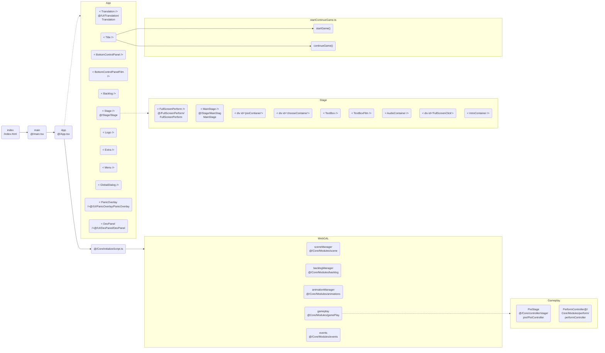

## 更新中

```mermaid
graph LR;
    index("index\n/index.html")
    main("main\n@/main.tsx");
    app("App\n@/App.tsx");
    initializeScript("@/Core/initializeScript.ts");
    subgraph App;
        translation("< Translation />\n@/UI/Translation/\nTranslation");
        stage("< Stage />\n@/Stage/Stage");
        bottomControlPanel("< BottomControlPanel />");
        bottomControlPanelFilm("< BottomControlPanelFilm />");
        backlog("< Backlog />");
        title("< Title />");
        logo("< Logo />");
        extra("< Extra />");
        menu("< Menu />");
        globalDialog("< GlobalDialog />");
        PanicOverlay("< PanicOverlay />@/UI/PanicOverlay/PanicOverlay");
        devPanel("< DevPanel />@/UI/DevPanel/DevPanel");
    end;
    subgraph Stage;
        fullScreenPerform("< FullScreenPerform />\n@/FullScreenPerform/\nFullScreenPerform");
        mainStage("< MainStage />\n@/Stage/MainStag\nMainStage");
        pixiContianer("< div id='pixiContianer'>");
        chooseContainer("< div id='chooseContainer'>");
        textBox("< TextBox />");
        textBoxFilm("< TextBoxFilm />");
        audioContainer("< AudioContainer />");
        fullScreenClick("< div id='FullScreenClick'>");
        introContainer("< IntroContainer />")
    end;
    subgraph WebGAL;
        sceneManager("sceneManager\n@/Core/Modules/scene");
        backlogManager("backlogManager\n@/Core/Modules/backlog");
        animationManager("animationManager\n@/Core/Modules/animations");
        gameplay("gameplay\n@Core/Modules/gamePlay");
        events("events\n@/Core/Modules/events");
    end;
    subgraph Gameplay;
        pixiStage("PixiStage\n@/Core/controller/stage/\npixi/PixiController");
        performController("PerformController@/\nCore/Modules/perform/\nperformController")
    end;
    subgraph startContinueGame.ts;
        startGame("startGame()");
        continueGame("continueGame()");
    end;
    app -.-> App;
    stage -.-> Stage;
    gameplay -.-> Gameplay;
    index --> main --> app;
    app--> initializeScript-->WebGAL;
    title--> startGame & continueGame;


```