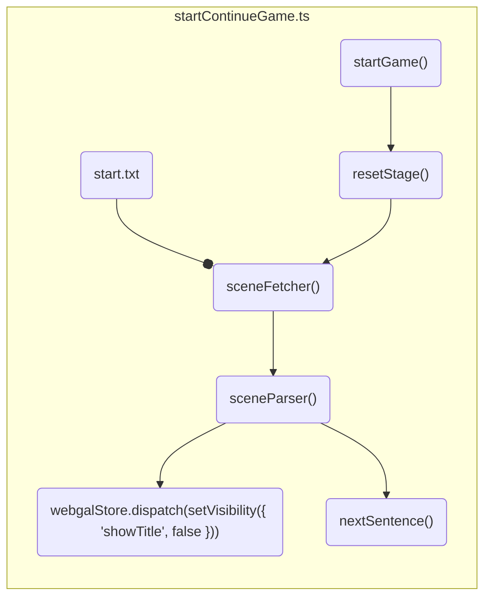

```mermaid
graph LR
    subgraph startContinueGame.ts;
        startTxt("start.txt");
        startGame("startGame()");
        resetStage("resetStage()");
        sceneFetcher("sceneFetcher()");
        sceneParser("sceneParser()");
        nextSentence("nextSentence()");
        showTitle("webgalStore.dispatch(setVisibility({ 'showTitle', false }))");

        startTxt --o sceneFetcher;
        startGame --> resetStage --> sceneFetcher --> sceneParser --> showTitle & nextSentence;
    end;

```